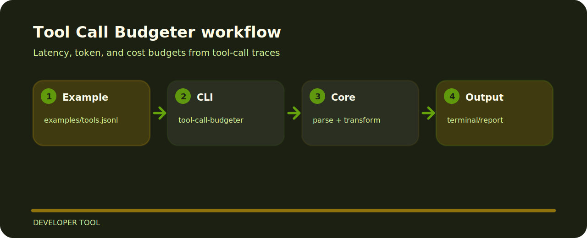

# Tool Call Budgeter


This project is a small, inspectable developer tool tool. It prefers concrete examples and local files over hidden setup.

| Detail | Value |
| --- | --- |
| Area | developer tool |
| Entry | `tool-call-budgeter` |
| Input | JSONL records |
| Output | readable terminal output |

## Shape of the tool



## First run

```bash
git clone https://github.com/mertefekurt/tool-call-budgeter.git
cd tool-call-budgeter
python -m pip install -e ".[dev]"
tool-call-budgeter examples/tools.jsonl --latency-target-ms 1200 --cost-budget 0.10
```
