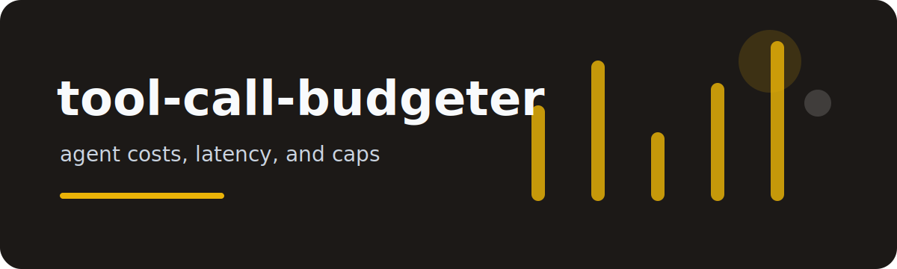

# tool-call-budgeter

Agent systems often fail through accumulation: one slow search, then three retries, then a tool call nobody
budgeted. This CLI turns tool-call traces into a small budget report.

## Trace row

```json
{"tool":"search","latency_ms":820,"tokens":1400,"cost_usd":0.0021}
```

## Budget pass

```bash
tool-call-budgeter examples/tools.jsonl --latency-target-ms 700 --cost-budget 0.01
```

It reports:

- calls per tool
- total tokens and cost
- approximate p95 latency
- budget notes such as "cache candidate" or "cost cap needed"

## Why no dashboard?

This is meant for CI artifacts, pull request notes, and local trace review. Plain text and JSON travel better
than a service dependency.

## Verification

`pytest` covers p95 calculation, grouping, recommendations, JSON output, CLI help, and empty traces.

MIT.
