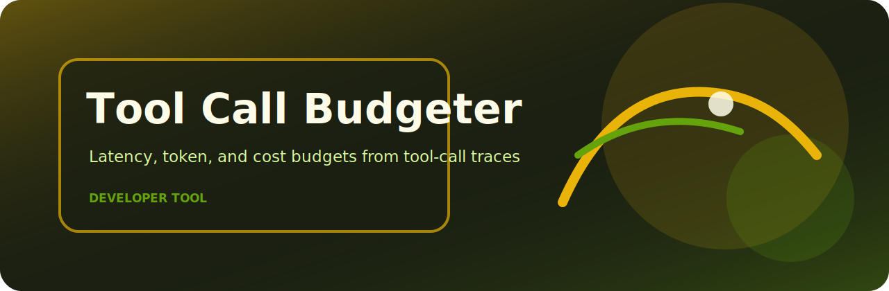

# Tool Call Budgeter

   



Summarize agent tool-call latency, token, and cost budgets.

## Use case

- quick local checks around tooling reviews
- small CI jobs where a readable report is enough
- review workflows that need deterministic output
- examples based on `examples/tools.jsonl`

## Local setup

```bash
git clone https://github.com/mertefekurt/tool-call-budgeter.git
cd tool-call-budgeter
python -m venv .venv
source .venv/bin/activate
python -m pip install -e ".[dev]"
```

## CLI

```bash
tool-call-budgeter examples/tools.jsonl
```

## Quality check

```bash
python -m pip install -e ".[dev]"
ruff check .
pytest
python -m tool_call_budgeter --help
```
